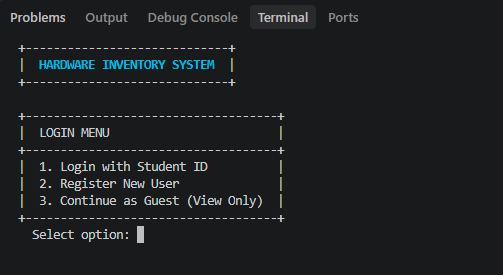
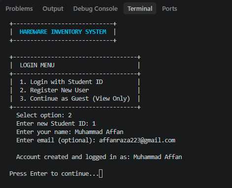
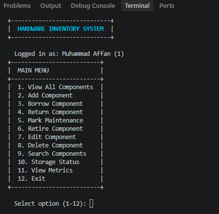
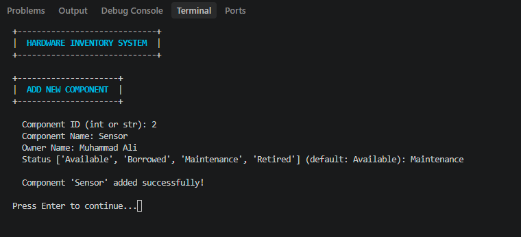
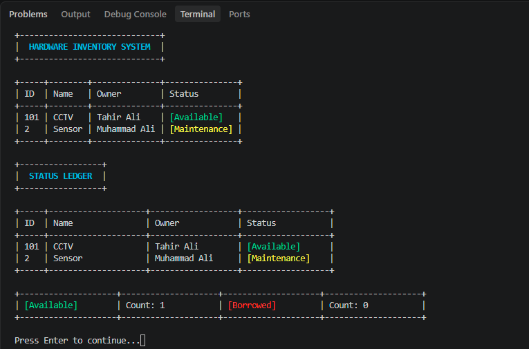
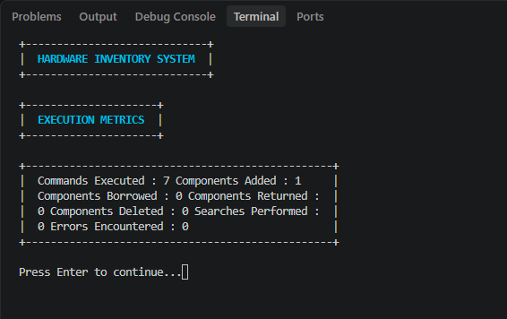
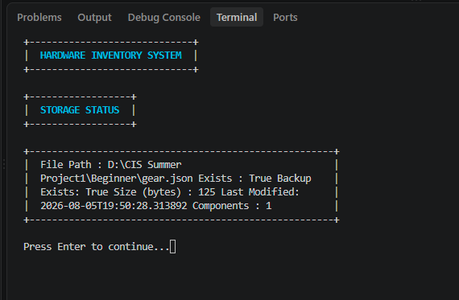
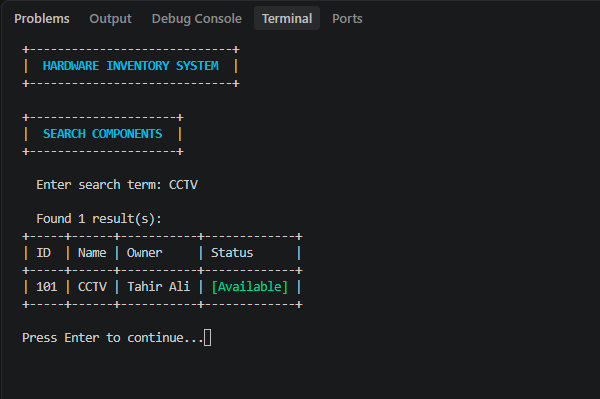

# ZeroToShip — Beginner Track

A terminal-based hardware inventory management system with session-based authentication.

## Project Overview

This project implements a **headless local validation engine and credential manager** for tracking hardware components. It provides secure session management and access control to prevent unauthorized modifications to hardware status fields.

---

## Phase 1 — Component Data Model

Defines the physical structure of hardware component objects with serialization support.

### Files
- `models/component.py` — `Component` class with `id` (int), `name` (str), `owner` (str), and `status` (defaults to "Available")
- `manual_test.py` — Demo script for instantiation and dictionary conversion

---

## Phase 2 — Authentication & Session Management

A lightweight user session log system that tracks actively logged-in terminal users and enforces access gatekeepers.

### Core Components

#### `services/auth.py`

| Class/Function | Description |
|----------------|-------------|
| `User` | Student profile model (student_id, name, email) |
| `Session` | Session token with timeout validation |
| `SessionManager` | Tracks active sessions, handles login/logout |
| `validate_session()` | Gatekeeper requiring active session |
| `can_modify_component()` | Ownership verification gatekeeper |
| `require_session` | Decorator for protecting functions |

### Key Features

**Authentication Flow:**
1. Register user → `session_mgr.register_user(student_id, name, email)`
2. Login → `session_mgr.login(student_id)` returns session token
3. Validate → `validate_session(session_mgr, session_id)` ensures active session
4. Logout → `session_mgr.logout(session_id)` destroys session

**Access Gatekeepers:**
- `validate_session()` — Raises `PermissionError` if no active session exists
- `can_modify_component()` — Returns `True` only if logged-in user owns the component
- `require_session` — Decorator that blocks function execution without valid session

### How to Run

```bash
py manual_test.py
```

**Expected Output:**
```
Original Object:
ID: 1, Name: Arduino Uno, Owner: Muhammad Affan, Status: Available

Dictionary:
{'id': 1, 'name': 'Arduino Uno', 'owner': 'Muhammad Affan', 'status': 'Available'}

Object Created from Dictionary:
ID: 1, Name: Arduino Uno, Owner: Muhammad Affan, Status: Available

==================================================
PHASE 2: Authentication & Session Management
==================================================

Registered User: Student ID: STU001, Name: Muhammad Affan, Email: affan@example.com
Session Created: 215f3f58c17a3395...
Session Validated: Muhammad Affan
Can modify component: True
Logged out successfully
Post-logout access attempt: Invalid or expired session. Please login again.
```

---

## Phase 3 — State Transitions & JSON Persistence

Operational application logic routines managing physical resource transformations and disk flat-file tracking.

### Core Components

#### `services/registry_core.py`

| Class/Function | Description |
|----------------|-------------|
| `GearRegistry` | In-memory component registry with state transition enforcement |
| `InvalidTransitionError` | Raised when a status change violates transition rules |
| `ComponentNotFoundError` | Raised when a component ID doesn't exist |
| `ValidationError` | Raised when input fails validation checks |
| `DuplicateComponentError` | Raised when adding a component with existing ID |
| `validate_component_data()` | Validates component dict has all required fields |

**State Transition Rules:**

| Current Status | Allowed Transitions |
|----------------|---------------------|
| Available | Borrowed, Maintenance, Retired |
| Borrowed | Available, Maintenance, Retired |
| Maintenance | Available, Retired |
| Retired | *(none — terminal state)* |

#### `services/storage.py`

| Class/Function | Description |
|----------------|-------------|
| `save_gear_data()` | Atomic write with backup and temp file pattern |
| `load_gear_data()` | Read with corruption detection and auto-restore |
| `save_single_component()` | Upsert a single component to storage |
| `delete_component()` | Remove a component by ID from storage |
| `get_storage_info()` | Returns file metadata and component count |
| `StorageError` | Base exception for storage failures |
| `CorruptedDataError` | Raised when JSON data is invalid or missing keys |
| `FileAccessError` | Raised for permission or OS-level file errors |
| `ValidationError` | Raised when input parameters are invalid |

### Key Features

**State Transition Enforcement:**
- Components can only transition to "Borrowed" if current status is explicitly "Available"
- All transitions validated against allowed paths before modification
- Invalid transitions raise `InvalidTransitionError` with descriptive message

**Fault-Tolerant Storage:**
- Atomic writes using temp file + rename pattern
- Automatic backup before every write operation
- Auto-restore from backup on JSON corruption
- Input validation on all save/load operations

**Input Validation:**
- Component ID: must be int or str, cannot be None/empty
- Component name/owner: must be non-empty str
- Status: must be one of the four valid statuses
- Filepath: must be non-empty str
- All functions validate inputs before execution

### How to Run

```bash
py manual_test.py
```

### Example Usage

```python
from models.component import Component
from services.registry_core import GearRegistry
from services.storage import save_gear_data, load_gear_data

# Create and register components
registry = GearRegistry()
comp1 = Component(1, "Arduino Uno", "Affan")
registry.add_component(comp1)

# Valid transition: Available → Borrowed
registry.borrow_component(1)
print(comp1.status)  # Borrowed

# Invalid transition: Borrowed → Borrowed (raises error)
registry.borrow_component(1)  # InvalidTransitionError

# Save to disk
save_gear_data(registry.to_dict_list())

# Load from disk
loaded = load_gear_data()
```

---

## Phase 4 — Static Terminal Display & Status Highlights

A presentation-layer terminal screen module built entirely on hardcoded dummy arrays and mock properties — no operational state is hooked up yet.

### Core Components

#### `services/cli_display.py`

| Class/Function | Description |
|----------------|-------------|
| `clear_screen()` | Clears the console using the platform-appropriate command |
| `render_table()` | Draws aligned ASCII grid tables using `+`, `-`, and `|` markers |
| `render_menu()` | Draws a bordered vertical menu centered around a title |
| `render_title_banner()` | Highlights a title inside an ASCII frame |
| `render_box()` | Word-wraps long text inside a bordered frame |
| `render_error()` | Renders a failure message inside an error frame |
| `colorize_status()` | Wraps `[Available]` in bright green escape chars, `[Borrowed]` in red |
| `render_status_ledger()` | Loops over mock components printing color-coded status tags |
| `render_components_table()` | Full grid table of the hardcoded inventory |
| `render_dashboard()` | Composes the complete static home screen |
| `show_home_screen()` | Clears the console and displays the dashboard |

#### Exceptions

| Exception | Description |
|-----------|-------------|
| `DisplayError` | Base exception for the display layer |
| `DisplayValidationError` | Invalid input (also a `ValueError` for compatibility) |
| `ComponentDataError` | Malformed component record (missing keys, wrong types) |
| `RenderError` | A screen fails to build from otherwise valid input |

### Error Handling & Input Validation

Every public rendering function validates its inputs before drawing:

- **Headers / Options / Rows** — must be non-empty lists of valid types
- **Title / Text / Status** — must be non-empty strings (None and whitespace rejected)
- **Padding / Width** — must be non-negative integers (bool rejected)
- **Summary flag** — must be a real boolean
- **Component records** — required keys (`id`, `name`, `owner`, `status`) enforced
- **Internal grid primitives** — cell counts and widths checked on every draw

Failures are contained so a bad call can never crash the session:

- `render_table()` validates column counts against header length
- `render_status_ledger()` / `render_components_table()` validate every record
- `render_dashboard()` wraps sub-screen failures in `RenderError`
- `show_home_screen()` catches any display failure and prints it inside an error frame via `render_error()`

### Key Features

**Terminal Interface Grid:**
- Screen-clearing function for both Windows (`cls`) and POSIX (`clear`)
- Uniform ASCII box borders (`+`, `-`, `|`) used for menus, banners, and tables
- Column widths auto-derived so every grid line stays perfectly aligned

**Status Tag Highlights:**
- `[Available]` → bright green ANSI escape characters (`\033[92m`)
- `[Borrowed]` → red highlight wrapper (`\033[91m`)
- `[Maintenance]` → yellow, `[Retired]` → gray
- ANSI-aware width calculation keeps columns aligned despite color codes

**Mock Data:**
- `MOCK_COMPONENTS` — hardcoded list of inventory dicts
- `MOCK_MENU` — hardcoded main menu options
- `STATUS_STYLES` — hardcoded status → color mapping

### How to Run

```bash
py services/cli_display.py
```

Runs the full static home screen. To see it embedded with earlier phases:

```bash
py manual_test.py
```

---

## Phase 5 — Final System Integration

The complete integrated application connecting all phases into a single, functional system.

### Core Components

#### `app.py`

| Feature | Description |
|---------|-------------|
| Main Controller Loop | Continuous while loop rendering dynamic menus |
| Session Integration | Login/register with Phase 2 auth tokens |
| Dynamic Data Loading | Loads components from JSON storage on startup |
| Real-time Updates | All modifications saved back to JSON file |
| Execution Metrics | Tracks commands, additions, borrows, errors |
| Ownership Enforcement | Only owners can modify their components |

### Menu Options

| Option | Function | Auth Required |
|--------|----------|---------------|
| 1. View All Components | Display full inventory table | No |
| 2. Add Component | Create new hardware entry | Yes |
| 3. Borrow Component | Change status to Borrowed | Yes |
| 4. Return Component | Change status to Available | Yes |
| 5. Mark Maintenance | Change status to Maintenance | Yes |
| 6. Retire Component | Change status to Retired (terminal) | Yes |
| 7. Edit Component | Update name or owner | Yes |
| 8. Delete Component | Remove from inventory | Yes |
| 9. Search Components | Find by name or owner | No |
| 10. Storage Status | View file metadata | No |
| 11. View Metrics | Display execution statistics | No |
| 12. Exit | Save data and quit | No |

### How to Run

```bash
py app.py
```

### Integration Flow

1. **Startup**: App loads existing data from `gear.json`
2. **Login**: User authenticates with student ID (or continues as guest)
3. **Menu Loop**: Dynamic menu renders with all available options
4. **Operations**: User selects actions that modify the registry
5. **Persistence**: All changes automatically save to JSON
6. **Exit**: Data persists between sessions

### Metrics Tracked

- Commands executed
- Components added/borrowed/returned/deleted
- Searches performed
- Errors encountered

### Error Handling & Input Validation

**Custom Exception:**
- `InputValidationError` — Raised when user input fails validation

**Validation Functions:**

| Function | Validates |
|----------|-----------|
| `_validate_student_id()` | Length, allowed characters (alphanumeric, hyphens, dots, underscores) |
| `_validate_name()` | Length, no special characters (`< > { } [ ] \| \`) |
| `_validate_email()` | Length, must contain `@` and `.` |
| `_validate_component_id_input()` | Non-empty, converts numeric strings to int, character validation |
| `_validate_status_input()` | Must be one of valid statuses |
| `_validate_search_term()` | Length limit enforced |

**Input Safety:**
- `_safe_input()` — Catches `EOFError` and `KeyboardInterrupt` gracefully
- All `input()` calls wrapped to prevent crashes on Ctrl+D/Ctrl+C
- Length limits prevent buffer overflow attacks
- Character validation blocks injection attempts

**Error Display:**
- All errors shown in bordered error frames via `render_error()`
- Tracking metrics count errors for debugging
- Session expiry detected and handled automatically

---

## Final Submission Information

### Project Information

**Project Description:**
ZeroToShip is a terminal-based hardware inventory management system designed for educational institutions, labs, and maker spaces to track and manage hardware components like microcontrollers, sensors, motors, and development boards. It provides secure session-based authentication, ownership-based access control, state transition enforcement, and persistent JSON storage — all implemented using pure Python standard library.

**Pain Point:**
Educational labs and maker spaces face critical challenges in managing shared hardware components. Without proper tracking, equipment frequently goes missing, there's no accountability for borrowed items, manual spreadsheets are error-prone and lack real-time status updates, and there's no centralized system to monitor availability across multiple users. Most existing solutions are either too expensive, require internet connectivity, or are overkill for small labs.

**Proposed Solution:**
A modular Python application with five integrated phases:
- **Phase 1:** Component data model with serialization
- **Phase 2:** Session-based authentication with ownership enforcement
- **Phase 3:** State machine (Available → Borrowed → Maintenance → Retired) with JSON persistence
- **Phase 4:** ASCII-framed terminal display with color-coded status tags
- **Phase 5:** Full integration with 12 menu options, input validation, and error handling

**Target Users:**
| User Type | Benefit |
|-----------|---------|
| Lab Instructors | Track equipment availability, manage student borrows |
| Students | View available components, borrow/return with accountability |
| IT Administrators | Monitor inventory status, ensure data integrity |
| Maker Space Coordinators | Manage shared resources across projects |
| Research Teams | Track specialized equipment and development boards |

---

### Development Details & Deliverables

**Technologies Used:**
| Technology | Purpose |
|------------|---------|
| Python 3.13 | Core programming language |
| JSON | Data persistence format |
| ANSI Escape Codes | Terminal color formatting |
| ASCII Art | UI borders and frames |
| Git/GitHub | Version control and hosting |

**External Libraries/Frameworks Used:**
None — The entire application is built using Python's standard library only (`json`, `os`, `sys`, `time`, `secrets`, `hashlib`, `shutil`, `re`).

**GitHub Repository Link:**
https://github.com/M-Affan01/ZeroToShip-Beginner.git

**Project Demonstration Video:**
*(Add your Google Drive link here)*

---

### Reflection & Future Scope

**Biggest Challenge Faced:**
The most difficult part was integrating all five phases into a cohesive application while maintaining data integrity and security. Specific challenges included:
1. Handling session expiration gracefully without crashing the main loop
2. Debugging ownership mismatch issues when users add components with different names
3. Implementing atomic file writes with backup/restore to prevent data corruption
4. Balancing user-friendly input with security through comprehensive validation
5. Ensuring state transitions enforced correctly while providing clear error messages

**How Modular Development Helped:**
Breaking the project into five independent modules provided significant advantages:
- **Independent Testing:** Each module could be tested in isolation before integration
- **Clear Responsibilities:** Each file has a single purpose (auth, storage, display, logic)
- **Parallel Development:** Work on different phases without breaking existing code
- **Code Reusability:** Components like `render_table()` used across multiple features
- **Easy Debugging:** Issues isolated to specific modules rather than monolithic codebase
- **Incremental Progress:** Each phase built upon the previous one seamlessly

**If Given Another Month:**
1. Multi-user roles (Admin, Instructor, Student) with different permission levels
2. Component history/audit trail with timestamps for all actions
3. Deadline tracking for borrowed items with overdue notifications
4. Database backend (SQLite/PostgreSQL) for better scalability
5. Web interface using Flask/Django for browser-based access
6. REST API for mobile app integration
7. Barcode/QR code support for quick scanning
8. Analytics dashboard with usage statistics and reports

**Future Scope:**
- **Cloud Deployment:** Host on AWS/Azure/GCP for institutional use
- **Mobile App:** React Native/Flutter application for iOS/Android
- **University Integration:** Connect with SSO systems and student databases
- **Multi-Language Support:** Internationalization for global adoption
- **Offline Mode:** Sync capabilities when internet is unavailable
- **Asset Management:** Extend to non-hardware assets (software licenses, tools)
- **AI-Powered Insights:** Predictive maintenance, usage pattern analysis
- **IoT Integration:** Hardware-based automatic tracking using sensors
- **Compliance:** FERPA/GDPR compliance for educational institutions

---

## Output Screenshots

| # | Screenshot |
|---|------------|
| 1 |  |
| 2 |  |
| 3 |  |
| 4 |  |
| 5 |  |
| 6 |  |
| 7 |  |
| 8 |  |

---

## Project Structure

```
Beginner/
├── models/
│   └── component.py          # Component data model
├── services/
│   ├── __init__.py
│   ├── auth.py               # Session management & gatekeepers
│   ├── registry_core.py      # State transition logic & validation
│   ├── storage.py            # JSON persistence layer
│   └── cli_display.py        # Terminal display & status highlights
├── Output/                   # Screenshots of application
│   ├── 1.png
│   ├── 2.png
│   ├── 3.png
│   ├── 4.png
│   ├── 5.png
│   ├── 6.png
│   ├── 7.png
│   └── 8.png
├── app.py                    # Main integrated application
├── manual_test.py            # Demo & testing script
├── gear.json                 # Data persistence file (auto-created)
├── .gitignore
└── README.md
```

---

## Git Commands

**Phase 2:**
```bash
git add services/auth.py services/__init__.py manual_test.py README.md
git commit -m "Phase 2 Complete: Build terminal user state tracking sessions and add state modification access gatekeepers"
git push origin main
```

**Phase 3:**
```bash
git add services/registry_core.py services/storage.py README.md
git commit -m "Phase 3 Complete: Deploy hardware state transition triggers and build fault-tolerant JSON storage pipelines"
git push origin main
```

**Phase 4:**
```bash
git add services/cli_display.py README.md manual_test.py
git commit -m "Phase 4 Complete: Complete static terminal display views, ASCII layout frames, and color-coded status highlights"
git push origin main
```

**Phase 5:**
```bash
git add .
git commit -m "Phase 5 Complete: Full project integration and final ship submission"
git push origin main
```

---

## Notes

- **Headless Architecture** — No GUI; operates entirely via terminal/CLI
- **Session Timeout** — Sessions expire after 1 hour (3600 seconds) by default
- **Ownership Model** — Users can only modify components they own
- **State Enforcement** — Invalid status transitions are blocked at the registry level
- **Data Safety** — Storage layer uses atomic writes with automatic backup/restore
- **Input Validation** — All user inputs validated with length limits and character checks
- **Error Handling** — Graceful handling of EOF, KeyboardInterrupt, and all exceptions
- **No External Dependencies** — Pure Python standard library implementation

Warm regards,

Head of Team Coding and Innovation
